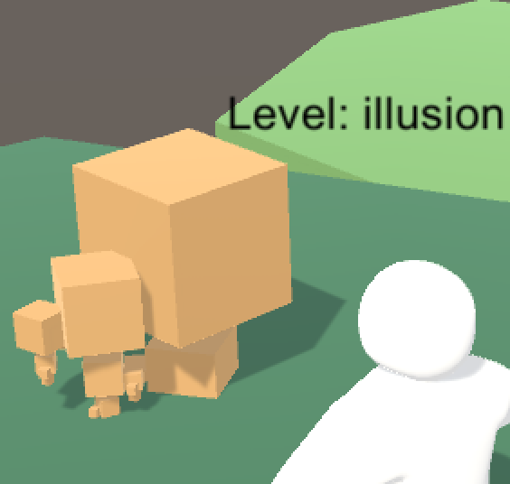
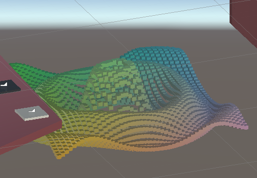
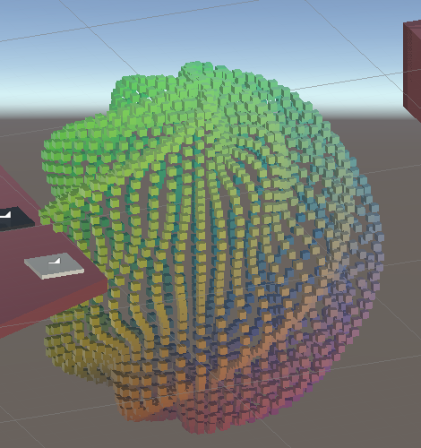
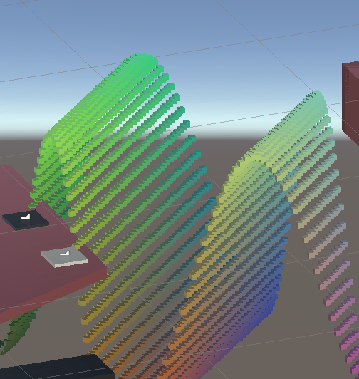
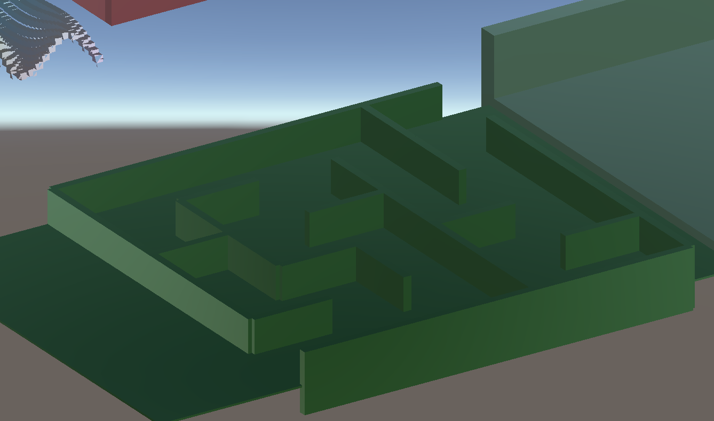
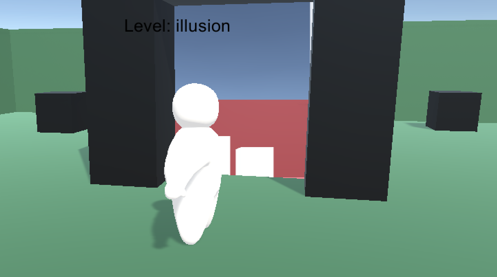
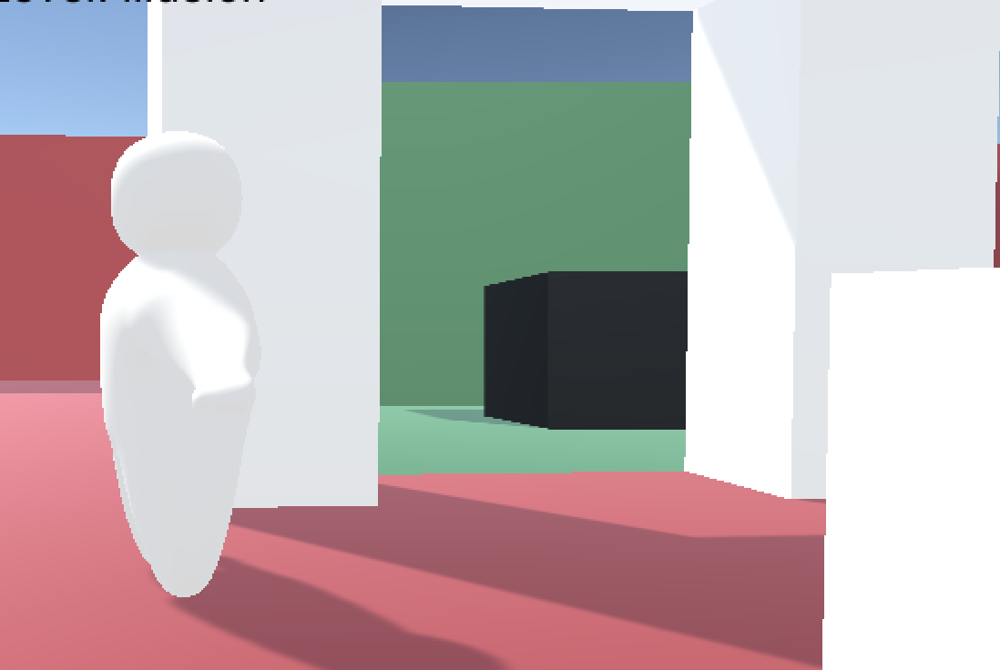
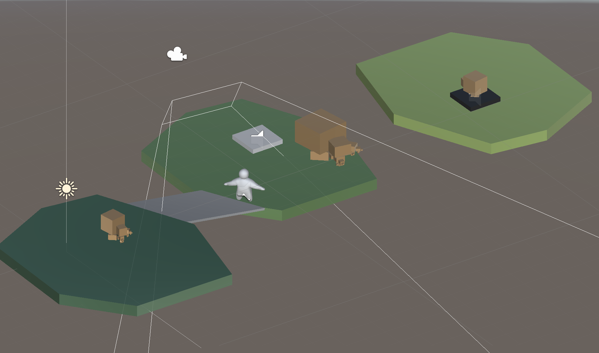

 
    
    
  <!--    -->
  

  <h1 align="center"> CS4455/6457 Video Game Design</h1>
  <h3 align="center"> Team Five Guys </h3>
  <h5 align="center"> Level_illusion by Jiaxi Xu </h5>
  
  
  <!-- TABLE OF CONTENTS -->
  <h2 id="table-of-contents"> 📖 Table of Contents</h2>
  
  

    
Table of Contents

    <ol>
      <li><a href="#overview"> ➤Overview</a></li>
      <li><a href="#feature"> ➤ Technologies </a>
         <ol>
            <li><a href="#post"> ➤ Fractal</a></li>
            <li><a href="#event"> ➤ Math Graphs </a></li>
            <li><a href="#timeline"> ➤ Maze </a></li>
            <li><a href="#map"> ➤ Teleportal  </a></li>
            <li><a href="#donation"> ➤ Shaders </a></li>
            <li><a href="#faq"> ➤ Design Principles </a></li>
         </ol>
      </li>
      <li><a href="#wiki"> ➤ Resources </a></li>
    </ol>
  

  
  
  # Overview 
  
  ### Design Idea
  The game is implemented in Unity and consists of a 3D world. The players control the active-ragdoll style character to interact with the fantasy world, solve puzzles, and launch to the next level. The design idea of Level_illsion is to display a mixture of both Euclidean and Non-Euclidean world. 
  
  ### How to Play
  AWSD to control the main character moving. SHIFT to speed up. Space key to jump Mouse moving to control the camera view. 
  
  
  # Features (Release 1.0) 
  
  ## Fractal 
  Recursion. Cubes are created one by one with differnt sizes and positions. 
  
  The creation process is delayer to show by using yield keyword. The entire object is rotating with respect to time.
  
  
  
  ## Math Graphs  
  
  Use mathematical functions to create six patterns: Wave, MultiWave, Ripple, Sphere, Torus. 
  They are displayed random in order using n * n cubes and with morphed transition.
  GUI controls resolution(n), function duration, and transition duration. 
  
     
   
  
  ## Maze 

  Maze is genereted recursively therefore is differnt every time. 
    For a n * n maze, init it to be a n * n grid, visit every spot and randomly remove walls.
    The data structures used includes stack, struct and enum. 
    For best game experience, the maze is changed every 10s with lower walls to add more variation without irritating the players. 
    
  
    

  ## Teleportal 

  The Non-euclidean element of the game. 
  The player get transpoted between two worlds. One world can be seen from the gate of the other world.
  
  

 
  ## Shaders 
 
  The color of the math graphs and the gate display of the teleportal. 
    Shader for math graphs relates color with position.
    Shader for teleportal renders camera view on plane. 

  
  ## Design Principles 

  The first three platforms with the fractal floating above are intended to teach players the functions of white/black buttons. 
  
  

  
  # Resources 
  Fractal, Math Graphs: [CatlikeCode](https://catlikecoding.com/unity/tutorials/) 
  
  Maze: [YouTube](https://www.youtube.com/watch?v=ya1HyptE5uc&t=346s) Tutorial By Sandeep Nambiar 
  
  Teleportal: [YouTube](https://www.youtube.com/watch?v=cuQao3hEKfs&t=19s&ab_channel=Brackeys) by Brackeys 
